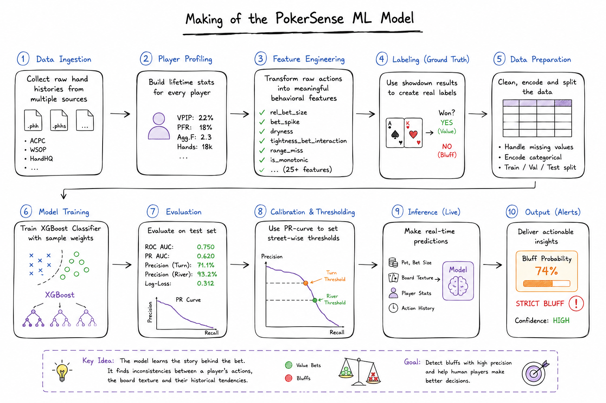
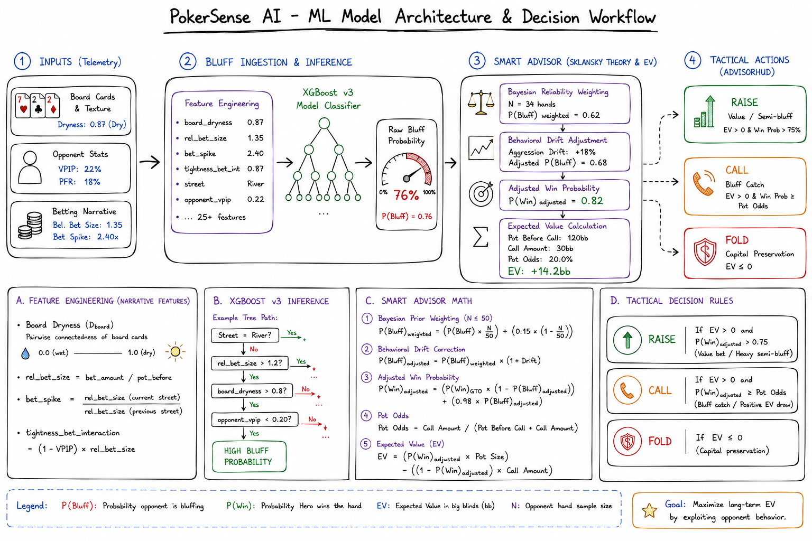

# Making of the bluff detector

The math half of PokerSense is a solved problem: equity by Monte Carlo, pot odds by
arithmetic. This document is about the other half, the part that had to be trained,
and mostly about the mistake I made first.



Two things in that diagram describe the design rather than the shipped code: the
threshold is not street-wise, and the showdown model trains without sample weights.
See [Limitations](#limitations).

## The mistake

The goal was a model that answers one question at the moment you have to act: is this
bet a bluff? The obvious problem is labels. A hand history tells you what everyone
bet, but not what they held, unless it went to showdown.

My first answer was weak supervision. I wrote a heuristic labeler
([heuristic_labeler_v3.py](src/labeling/heuristic_labeler_v3.py)) that scored each bet
on the things I believed marked a bluff: big bet, dry board, tight player, a jump in
aggression from the previous street. It emitted a soft label and a confidence weight,
and I trained on 18,000 Zenodo records with those weights.

It scored respectably and it was worthless. The labels were my own assumptions written
down, so the model's job was to reproduce my heuristic, and its accuracy measured how
well it had done that. Where the heuristic was wrong the model was confidently wrong
in the same direction, and nothing in the metrics could tell me so. The one thing the
exercise was supposed to provide, an opinion that was not mine, was the one thing it
structurally could not.

## What fixed it

Scaling the ingestion for more data turned up the actual answer. Parsing HandHQ
`.phhs` files, roughly 5.8M hands, surfaced about 615,000 bets that ended in a
showdown. Those have real labels. The cards were turned over, so whether the bet was a
bluff is a fact rather than an opinion.

So the labeling strategy changed completely: throw away the heuristic labels, keep only
showdown rows, and train on ground truth. `train_showdown_model.py` filters to
`true_label.notna()` and never looks at a heuristic score.

The cost is selection bias, and it is worth being explicit about it. Hands that reach a
showdown are not a random sample of hands. A bluff that works is a bluff you never see,
so the training set systematically overrepresents bluffs that got called. The model
learns to recognize the kind of bluff that gets caught. For a tool whose job is to tell
you when to call, that bias points in a useful direction, but it is a bias and not a
feature.

## Pipeline

Each stage writes a parquet file and the next stage reads it, so any stage can be rerun
without redoing the ones before it.

| Stage | Code | What it does |
| --- | --- | --- |
| Ingest | [`parsers/data_loader.py`](src/parsers/data_loader.py), [`aggressive_parser.py`](src/parsers/aggressive_parser.py) | Walks `.phh`/`.phhs` files, filters to NLHE (`variant == "NT"`), emits one row per betting action |
| Profile | [`calculate_player_stats_aggressive.py`](src/features/calculate_player_stats_aggressive.py) | Lifetime VPIP, PFR and aggression factor per player identity, in pandas chunks |
| Features | [`engineer_features_v3.py`](src/features/engineer_features_v3.py) | 27 columns from the raw action rows, 16 of which the model uses |
| Label | [`heuristic_labeler_v3.py`](src/labeling/heuristic_labeler_v3.py) | The v1 path, kept for comparison. Superseded by showdown labels |
| Train | [`train_showdown_model.py`](src/models/train_showdown_model.py) | XGBoost on showdown rows, split by player |
| Serve | [`packages/ai/bluff_detector.py`](../packages/ai/bluff_detector.py) | Recomputes the same 16 features from a live game state |

Three ingestion details cost more time than they should have. The first two I hit
while building it; the third I only found afterwards, writing tests for a parser I
had assumed was correct.

**`pokerkit` deprecated `.states` in favour of a `.state_actions` generator**, which
broke the parser outright. Moving to the generator was the fix, and it also dropped
peak memory enough to make 5.8M rows practical, since the old code materialised every
state of a hand before touching any of it.

**Hand ids collided across sources.** ACPC, WSOP and HandHQ all number their hands
from 1, so merging them silently overwrote rows. `extract_hand_id` now builds the id
from the file's path relative to the dataset root plus the hand's index within the
file, which is unique by construction and, unlike a hash, still tells you where a row
came from when you are debugging one.

**The generator hands you the state after the action, not before it**, and I read it
the other way round. `state.actor_index` therefore names the next player to act, so
every bet was credited to the wrong player and, through the `player_id` join, given
the wrong hole cards. `state.pots` likewise holds only chips already gathered, with
outstanding bets waiting in `state.bets` until the street closes, so the pot the
bettor was facing was understated whenever there was live action to face. Nothing
crashed and no row looked odd in isolation, which is why it survived a full training
run. It took writing an assertion against a hand whose outcome I knew to see it. See
the first entry under [Limitations](#limitations) for what that means for the model
in `packages/ai/models/`.

## Features

Sixteen, and the interesting ones are not the raw measurements.

```
street, rel_bet_size, bet_spike, dryness, dryness_delta, bet_bin,
vpip, pfr, spr, bet_size_diff, is_monotonic, range_miss,
dryness_bet_interaction, vpip_bet_interaction, tightness_bet_interaction, agg_profile
```

**`rel_bet_size`** is `bet_amount / pot_before`. A 500 chip bet means nothing on its
own; half the pot means something.

**`dryness`** scores board texture from pairwise connectedness of the community cards,
rank gaps and suit repeats, normalised so 1.0 is a rainbow board with no draws and 0.0
is soaking wet. Computed once per distinct board and mapped, because the same flop
recurs constantly across 5.8M hands.

**`dryness_delta`** is the change since the previous street, and it turned out to
matter more than `dryness` itself. A board getting wetter changes what a continued bet
means; a board getting drier changes it the other way.

**`bet_spike`** is this bet over the largest bet on the previous street. Polarised
ranges spike.

**`tightness_bet_interaction`** is `(1 - vpip) * rel_bet_size`. This is the feature I
would keep if I could keep one. Bet size alone is nearly meaningless without the
player: a pot-sized bet from someone playing 15% of hands and the same bet from someone
playing 60% are different events, and a tree cannot combine two features into a product
on its own, it can only split on each. Handing it the product directly is what lets the
model learn style-relative aggression instead of absolute aggression.

**`range_miss`** is a heuristic proxy, and the one feature I am least sure earns its
place:
`vpip * (dryness + clip(dryness_delta, 0, 1)) * log1p(bet_spike) * (2 - is_monotonic)`.
It is meant to approximate "this player's opening range probably missed this board and
they are betting anyway". It survives because dropping it hurt, not because I can
defend every term.

**`is_monotonic`** flags whether aggression is still increasing (`rel_bet_size >=
prev * 0.9`). Small, small, overbet is a different story from small, medium, large.

## Training

XGBoost, 1000 trees, learning rate 0.05, depth 6, 0.8 subsample and column sample,
`hist` tree method.

The choice of XGBoost over a sequence model was not about accuracy. These features are
heterogeneous: chip amounts, a street index, ratios bounded at 1, an unbounded
aggression profile. Trees split on each feature independently and do not care about
scale, so there is no normalisation layer to get wrong. And the model's output has to
be arguable in a UI that tells someone to put money in, which means being able to read
gain by feature and check that the top of the list is poker rather than an artifact.
`train_showdown_model.py` logs feature importance for exactly that reason.

**The split is grouped by player, not by row.** 80% of unique `player_id` values go to
train, the rest to test, so no player appears on both sides. This is the detail that
makes the numbers mean anything. A random row split leaks: the same opponent's VPIP,
PFR and betting habits show up in training and test, the model partly memorises
individuals, and precision comes back inflated. Splitting by player forces it to
generalise to opponents it has never seen, which is the only case that matters live.

`GroupKFold` is imported in that file and never used. The player split above is done by
hand instead, and the import is left over.

## Calibration

The raw probability is not the product. Precision is.

A false positive here means the tool said "he is bluffing", the user called, and the
opponent had it. That costs a stack. A false negative means the tool stayed quiet and
the user folded to a bluff, which costs the pot. The first is several times more
expensive than the second, so recall is the thing to spend.

So training sweeps the precision-recall curve for a target precision of 0.70 and takes
the lowest threshold that still clears it, which is the most recall available at that
precision. Measured on a held-out 123,000 showdown rows:

| Metric | Value | What it means here |
| --- | --- | --- |
| River precision | 93.2% | Of river bets flagged as bluffs, 93% were |
| Turn precision | 71.1% | One street less board information, and it shows |
| ROC AUC | 0.750 | Ranks bluffs above value bets across all thresholds |
| PR AUC | 0.620 | The honest number for a rare positive class |
| Log loss | 0.312 | Probabilities are calibrated, not just ordered |
| Inference latency | ~12 ms | Fast enough to answer inside a hand |

Recall is roughly 50%. The detector says nothing about half of all bluffs. That is the
trade, made deliberately.

## From probability to advice



The model's output is one input to the recommendation, not the recommendation.
[`smart_advisor.py`](../packages/ai/smart_advisor.py) does the rest:

**Shrink toward a baseline when the sample is thin.** With no history on an opponent,
the bluff detector's opinion of them is built from default VPIP and PFR, so it is not
worth much. The advisor blends it toward a 15% baseline bluff frequency in proportion
to how much data exists:

```
weight = min(1.0, hands_observed / 50)
p_bluff = (model_p * weight) + (0.15 * (1 - weight))
```

At zero hands the model is ignored entirely. At 50 it is trusted fully. Nothing in the
UI ever shows a confident read built on three hands.

**Adjust for a shift.** If the session tracker sees a player's aggression moving off
their own baseline, `p_bluff` is scaled by 1.2 or 0.8. Tilt is real and lifetime stats
are slow to reflect it.

**Fold the bluff read into equity, then compare against the price.** A call that wins
whenever the opponent was bluffing has a higher effective win probability than raw hand
equity:

```
p_win_adjusted = (p_win * (1 - p_bluff)) + (0.98 * p_bluff)
```

[`move_recommender.py`](../packages/ai/move_recommender.py) then compares that against
pot odds (`call / (pot + call)`): raise above 75% adjusted equity, call when EV is
positive and equity beats the price, otherwise fold. This is where a bluff read earns
its keep, by moving a marginal fold into a call, and it is also why precision was the
metric to optimise. A bad read does not shade the advice, it inverts it.

## Limitations

- **The shipped model was trained before a parser bug was found, and predates the
  fix.** `PHHParser` read pokerkit's `state.actor_index` to decide who made each
  bet. pokerkit pairs an action with the state *after* it is applied, so that field
  names whoever acts next, and every bet was credited to the following player.
  Because hole cards are joined back on `player_id`, each bet also inherited the
  wrong player's cards. On the hand in `tests/unit/test_phh_parser.py`, four barrels
  from a player holding 6d5h on JcTs2dAsQs were recorded against the player holding
  top pair, which inverts the label rather than blurring it. The same misreading
  made `pot_before` count only chips already gathered, ignoring bets still in front
  of players, so `rel_bet_size` and `spr` were wrong on any street with outstanding
  action. Both are fixed and pinned by tests. The `.joblib` in
  `packages/ai/models/` was fit on the old output, so the metrics below describe a
  model trained on mislabeled data and it needs a full retrain on the corpus, which
  I do not currently have the disk to redo.
- **The calibrated threshold is computed and then thrown away.** Training finds the
  threshold that hits 70% precision and logs it. Nothing persists it, and both
  inference paths hardcode a flat `0.4` on every street. The per-street precision
  numbers in `inference_api.py`'s `precision_map` are a hardcoded record of one
  calibration run, not something derived at load time. Wiring the threshold into the
  saved artifact is the first thing I would fix.
- **The threshold is not per-street, though it should be.** River and turn precision
  differ by 22 points at the same cutoff, which is exactly the case for a per-street
  threshold. There isn't one.
- **Feature importance is XGBoost gain, not SHAP.** Gain tells you which features the
  trees split on profitably overall. It does not explain an individual prediction, so
  the reasoning shown in the UI is written from the features, not derived from the
  model's own attribution for that row.
- **Heads-up only in practice.** Features like `range_miss` assume one opponent's range
  against one board. Multi-way pots fall back to the simplified heuristic.
- **Showdown-only labels carry the selection bias described above.** Successful bluffs
  are invisible to the training set by definition.
- **No timing data.** How long someone takes to act is one of the strongest tells in
  online poker and none of these datasets record it, so none of it is here.
- **Nothing detects model drift.** If the population's betting tendencies move, the
  model quietly gets worse and there is no monitoring that would say so.
